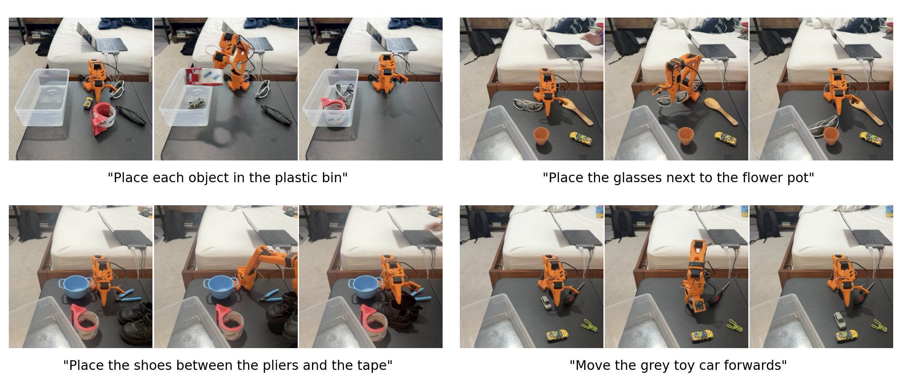

# SO-101 Bench

**Measuring the Gap Between Semantic and Geometric Competence in Vision-Language-Action Models**



SO-101 Bench is a compact real-world benchmark for language-conditioned tabletop
manipulation with an [SO-101](https://github.com/TheRobotStudio/SO-ARM100) robot
arm, plus an Isaac Lab digital twin of the same setup for scalable simulated
evaluation and real-to-sim correspondence studies.

This repository contains:

- the **Isaac Lab environment** (`source/so101_bench`) that recreates the bedroom
  tabletop, plastic bin, household objects, and the four benchmark task families;
- **evaluation scripts** for running a GR00T-N1.6 (or MolmoAct2) policy in the
  simulator and recording/scoring LeRobot datasets;
- **teleoperation, replay, and offline scoring** tooling for building and grading
  simulated demonstration datasets;
- the **task / layout JSONL files** that define each evaluation episode, and the
  **footprint geometry** used to place objects and score spatial tasks.

---

## Table of contents

- [What the project set out to accomplish](#what-the-project-set-out-to-accomplish)
- [How this repository works](#how-this-repository-works)
- [Environment and installation](#environment-and-installation)
- [Quickstart / smoke tests](#quickstart--smoke-tests)
- [GR00T inference with `groot_eval.py`](#gr00t-inference-with-groot_evalpy)
- [Downloading the USD assets](#downloading-the-usd-assets)
- [Adding an asset and computing its footprint polygon](#adding-an-asset-and-computing-its-footprint-polygon)
- [Teleoperation with an Xbox controller](#teleoperation-with-an-xbox-controller)
- [Replaying a LeRobot dataset](#replaying-a-lerobot-dataset)
- [Scoring collected simulation datasets](#scoring-collected-simulation-datasets)
- [MolmoAct2 zero-shot inference](#molmoact2-zero-shot-inference)
- [Repository layout](#repository-layout)
- [Citation](#citation)

---

## What the project set out to accomplish

Vision-language-action (VLA) models have advanced quickly, but their real-world
evaluation remains limited — especially for tasks that demand precise geometric
reasoning and generalization to novel objects. SO-101 Bench is a small-hardware,
high-diagnostic benchmark designed to probe exactly that frontier. It evaluates a
fine-tuned **GR00T-N1.6-3B** policy on an SO-101 arm over four language-conditioned
tasks and **56 household objects** split into seen / unseen-seen-class /
unseen-unseen-class regimes.

### The four tasks

1. **Place each object in the plastic bin** — the pure grasping task. The bin moves
   each trial; the policy must identify, grasp, transport, and deposit objects in
   ≤3 attempts. Evaluated in 1-object and 4-object conditions.
2. **Place [object 1] next to [object 2]** — relative placement within 2 inches of
   a referent, without colliding with other objects.
3. **Place [object 1] between [object 2] and [object 3]** — centered placement
   between two referents; the most geometrically demanding task.
4. **Move [object 1] [direction]** — displace an object in a commanded direction
   along a straight trajectory, respecting boundaries induced by other objects, the
   bin, or the table edge.

Distractors (same class, same color) are strategically included so the policy
cannot succeed from class identity alone, and color words are often omitted to keep
language grounding nontrivial.

### Generalization splits

- **Seen** — 24 objects that appear during fine-tuning.
- **Unseen / seen class** — 17 objects whose *class* (e.g. bowl, pen) was seen but
  whose specific *instance* was not.
- **Unseen / unseen class** — 15 entirely novel objects.

### Headline findings

The fine-tune is strong on familiar objects and simple settings, but degrades
sharply under spatial constraints, multi-object scenes, and object novelty.

| Task                  | Seen  | Unseen / seen class | Unseen / unseen class |
|-----------------------|:-----:|:-------------------:|:---------------------:|
| Bin (1 object)        | 97.4% | 92.5%               | 57.5%                 |
| Bin (4 objects)       | 78.5% | 48.4%               | 6.5%                  |
| Next to               | 55.0% | 46.3%               | 25.0%                 |
| Between               | 43.9% | 36.4%               | 6.3%                  |
| Move                  | 56.9% | 51.1%               | 33.3%                 |

The dominant bottleneck is **geometric execution**, not high-level language
understanding: imprecise grasps, poor grasp strategy on unfamiliar geometry, weak
recovery behavior, and failures of spatial composition. The central empirical
message is that **semantic competence has advanced faster than geometric and
physical competence**.

### Why a digital twin

The real benchmark is expensive to run at scale. This repository reconstructs the
bedroom/tabletop scene in **Isaac Lab** with scanned object assets so the same
tasks, arrangements, and instructions can be instantiated in simulation. This
enables (1) direct real-to-sim correspondence studies and (2) scaling to a much
larger object set for cheaper, reproducible policy iteration. See the paper
(`27_SO_101_Bench_Measuring_Obje (1).pdf`) for full details.

---

## How this repository works

The Isaac Lab environment is packaged as an extension under `source/so101_bench`.
It registers several Gymnasium task IDs, one per benchmark task family:

| Task ID                              | Description                                               |
|--------------------------------------|----------------------------------------------------------|
| `So101Bench-Bin-v0`                  | Place each object (or the single object) in the plastic bin. |
| `So101Bench-Bin-SingleObject-v0`     | Bin task with exactly one randomly selected object slot active. |
| `So101Bench-Bin-Object1-v0` … `-Object4-v0` | Bin task with a specific object slot active.       |
| `So101Bench-NextTo-v0`               | Place one object next to another.                        |
| `So101Bench-Between-v0`              | Place one object between two referents.                  |
| `So101Bench-Move-v0`                 | Move one object in a commanded direction.                |
| `So101Bench-Mixed-v0`                | Sample among all four task families.                     |

Each episode is driven by two inputs:

- **Task file** (`--episodes_jsonl`): a JSONL file, one row per episode, giving the
  `objects` present and a benchmark `instruction`. Object names are validated
  against `OBJECT_SPLITS` in
  [`benchmark.py`](source/so101_bench/so101_bench/benchmark.py) and mapped to local
  USD files by replacing spaces with underscores (`"green shoes"` →
  `assets/usd/objects/green_shoes.usdc`). Example rows:

  ```json
  {"objects": ["grey wires"], "instruction": "Place each object in the plastic bin"}
  {"objects": ["black glasses", "silver glasses", "yellow toy car", "cardboard box"], "instruction": "Place the yellow toy car next to the silver glasses."}
  {"objects": ["black glasses", "silver glasses", "yellow toy car", "cardboard box"], "instruction": "Place the cardboard box between the black glasses and the yellow toy car."}
  {"objects": ["black glasses", "silver glasses", "yellow toy car", "cardboard box"], "instruction": "Move the cardboard box forwards."}
  ```

- **Layout file** (`--episode_layouts_jsonl`, alias `--layouts_jsonl`, *optional*):
  a JSONL file of precomputed object and bin initial poses. Rows are matched to
  episodes by `trial_id` when present, otherwise consumed in order. Provided
  layouts are applied **as-is** (not revalidated), which lets you replay exact
  real-world arrangements. If omitted, the environment samples a feasible layout
  using each object's footprint geometry and the task's solvability filter.

The simulator reproduces the paper's measurable scoring rules automatically: the
3-grasp-attempt cap, the 1-inch bin-displacement limit, 0.5-inch non-target
displacement limits, bin containment, next-to surface distance, the between-task
center-line rule, and directional move boundaries. Illustrated, editable diagrams
of this logic live in [`docs/`](docs/):

- [`docs/object_placement.png`](docs/object_placement.png) — the layout sampler and per-task solvability filters.
- [`docs/non_bin_evaluation_logic.png`](docs/non_bin_evaluation_logic.png) — next-to / between / move scoring.
- [`docs/footprint_geometry.png`](docs/footprint_geometry.png) — the footprint and bounding-box pipeline.
- [`docs/success_failure_conditions.png`](docs/success_failure_conditions.png) — success/failure conditions per task.

---

## Environment and installation

All commands assume the Isaac Lab Python environment at **`~/env_isaaclab_51`** and
the Isaac Lab launcher at **`~/IsaacLab/isaaclab.sh`**.

- Anything that launches Isaac Sim is run via `~/IsaacLab/isaaclab.sh -p <script>`
  (the launcher uses `~/env_isaaclab_51` internally).
- Offline tools that do not start the simulator can be run directly:
  `source ~/env_isaaclab_51/bin/activate` then `python <script>`.

> The `~/env_isaaclab_51` env runs the simulator. (A separate `~/env_isaaclab` env
> exists only for lightweight USD/`pxr` editing.)

Install this extension into the Isaac Lab environment:

```bash
~/IsaacLab/isaaclab.sh -p -m pip install -e source/so101_bench
```

The environment loads local USD assets for the bedroom tabletop, plastic bin, and
objects. Those meshes are **not** committed to git — see
[Downloading the USD assets](#downloading-the-usd-assets) before running anything
that renders the scene.

---

## Quickstart / smoke tests

List the registered tasks:

```bash
~/IsaacLab/isaaclab.sh -p scripts/list_envs.py
```

Run the environment with a zero-action debug agent:

```bash
~/IsaacLab/isaaclab.sh -p scripts/zero_agent.py --task So101Bench-Bin-v0 --enable_cameras
```

Inspect the first JSONL episode's initial scene without stepping physics:

```bash
~/IsaacLab/isaaclab.sh -p scripts/groot_eval.py \
  --task So101Bench-Bin-v0 \
  --episodes_jsonl tasks/real_gr00t_WM_combined.jsonl \
  --inspect_initial_scene
```

---

## GR00T inference with `groot_eval.py`

`scripts/groot_eval.py` evaluates a GR00T-N1.6 policy server against a task file in
the digital twin, optionally recording a LeRobot dataset of the rollouts.

### 1. Download the policy

The benchmark checkpoint is hosted on Hugging Face at
**[`5hadytru/so101_GR00T_N1.6-3B_WM_v7_50k`](https://huggingface.co/5hadytru/so101_GR00T_N1.6-3B_WM_v7_50k)**.
This is the *working-memory (WM)* fine-tune: in addition to the live wrist/overhead
frames it conditions on the settled overhead frame captured at the start of the
episode (`overhead_init`), the simple working-memory baseline from the paper.

```bash
huggingface-cli download 5hadytru/so101_GR00T_N1.6-3B_WM_v7_50k \
  --local-dir ~/workspace/so101_GR00T_N1.6-3B_WM_v7_50k
```

### 2. Start the GR00T policy server

The server ships with NVIDIA's [Isaac-GR00T](https://github.com/NVIDIA/Isaac-GR00T)
codebase. Start it in its own environment, pointing at the downloaded checkpoint:

```bash
python gr00t/eval/run_gr00t_server.py \
  --model-path ~/workspace/so101_GR00T_N1.6-3B_WM_v7_50k/checkpoint-50000/ \
  --embodiment-tag NEW_EMBODIMENT \
  --device cuda \
  --host 127.0.0.1 \
  --port 5555
```

### 3. Run the evaluator

Pass a **task file** with `--episodes_jsonl`, an optional **layout file** with
`--episode_layouts_jsonl`, and add `--record_dataset` to save a LeRobot dataset of
the rollouts:

```bash
~/IsaacLab/isaaclab.sh -p scripts/groot_eval.py \
  --task So101Bench-Bin-v0 \
  --episodes_jsonl tasks/real_gr00t_WM_combined.jsonl \
  --episode_layouts_jsonl tasks/layouts/real_gr00t_WM_combined_layouts.jsonl \
  --policy_host localhost \
  --policy_port 5555 \
  --action_horizon 16 \
  --use_overhead_init true \
  --record_dataset \
  --repo_root data/lerobot/groot_n16_real_sim_1_ah16 \
  --headless
```

Notable flags:

- `--episodes_jsonl` *(required)* — the task file; every row is validated against
  `OBJECT_SPLITS` before evaluation.
- `--episode_layouts_jsonl` — apply exact recorded object/bin poses instead of
  sampling new ones.
- `--num_episodes N` — evaluate only the first `N` rows (default: all).
- `--action_horizon` — action steps executed per server query (16 matches the WM
  checkpoint above).
- `--use_overhead_init true` — send the settled `overhead_init` frame each request
  (required for WM-conditioned checkpoints).
- `--lang_instruction "..."` — override the policy language with a fixed string
  (the scene still comes from the JSONL row).
- `--rename_map '{"wrist":"ego","overhead":"external"}'` — remap sim camera names
  to your policy's expected video keys. By default the sim `wrist` camera is sent as
  the policy key `front` to match the SO100/SO101 real-robot GR00T scripts.
- `--record_dataset` with `--repo_root` / `--repo_id` — write a LeRobot dataset
  (actions, states, and camera frames). The default AV1 codec (`libsvtav1`) keeps
  recordings merge-compatible with the real dataset.

During a run, press `P` in the Isaac window to snapshot all cameras and `N` to skip
to the next episode (these can also be typed into the launch terminal).
`scripts/launch_groot_eval.sh` shows a full recording sweep at action horizons 8 and
16.

### The dataset

The current demonstration dataset is
**[`5hadytru/so101_bench_real_sim_1`](https://huggingface.co/datasets/5hadytru/so101_bench_real_sim_1)**
— roughly **4.4k real** teleoperated demos (~20 hours) plus **500 sim** demos. It
combines the real SO-101 teleoperation data used to fine-tune GR00T-N1.6-3B with
simulated demonstrations collected in this digital twin, and is the dataset the
recording defaults are kept compatible with.

---

## Downloading the USD assets

The Isaac Lab scene needs USD meshes for the room scan, plastic bin, SO-101 arm, and
the ~52 tabletop objects (about **430 MB** total under
`source/so101_bench/so101_bench/assets/usd/`). These binaries are **gitignored**
(see `.gitignore`: `**/assets/usd`, `**/assets/glb`), so they are hosted separately
and must be downloaded into place. The generated footprint JSONs in
`assets/objects/` *are* committed, so only the meshes need fetching.

### Downloading

If you have a hosted assets archive (e.g. on a Hugging Face dataset repo such as
`5hadytru/so101_bench_assets`), download and extract it into the assets directory:

```bash
huggingface-cli download 5hadytru/so101_bench_assets so101_bench_usd_assets.tar.gz \
  --repo-type dataset --local-dir /tmp/so101_assets

tar -xzf /tmp/so101_assets/so101_bench_usd_assets.tar.gz \
  -C source/so101_bench/so101_bench/assets/
```

After extraction you should have
`source/so101_bench/so101_bench/assets/usd/{room_scan.usdc, plastic_bin.usdc,
SO-ARM101-USD.usd, objects/, textures/}`.

### Hosting the `assets/` directory yourself

To publish the assets for others to download, pack the `usd/` tree and upload it to
a Hugging Face dataset repo (recommended, since the model and demonstration data
already live on Hugging Face):

```bash
# 1. Create the archive (run from the repo root).
tar -czf so101_bench_usd_assets.tar.gz \
  -C source/so101_bench/so101_bench/assets usd

# 2. Create a dataset repo once, then upload.
huggingface-cli repo create so101_bench_assets --repo-type dataset
huggingface-cli upload 5hadytru/so101_bench_assets \
  so101_bench_usd_assets.tar.gz --repo-type dataset
```

Any object/file host works (S3, GCS, a release attachment, etc.) — a single
~430 MB tarball is the simplest. As an alternative, the repo already configures
**Git LFS** for `*.usd*` in `.gitattributes`; you could instead remove the
`**/*.usd*` and `**/assets/usd` lines from `.gitignore` and commit the meshes via
LFS, at the cost of a much heavier clone.

If you use a different on-disk location for the bedroom/tabletop USD, update
`BEDROOM_TABLETOP_USD` in
[`so101_bench_env_cfg.py`](source/so101_bench/so101_bench/tasks/direct/so101_bench/so101_bench_env_cfg.py).

---

## Adding an asset and computing its footprint polygon

A benchmark object is a single USD mesh with a strict internal structure plus a
generated top-down **footprint polygon** used for placement and spatial scoring.

### 1. Author the object USD

Save the mesh as
`source/so101_bench/so101_bench/assets/usd/objects/<label_with_underscores>.usdc`
(the JSONL label maps to this filename by replacing spaces with underscores). It
must satisfy:

- **One default prim**, authored at **real-world scale in meters**.
- **Origin at the base, authored level.** The object should rest flat on the table
  with no baked tilt or `/root` translation — a baked tilt once made the yellow
  flashlight roll after spawn. The environment loads objects with identity scale and
  rotation.
- A **`physics`** subtree containing collision `Mesh` prim(s) with `UsdPhysics`
  collision applied and a bound physics material. The footprint generator and the
  asset checker both locate collision geometry by the ancestor prim named `physics`.
- A **`visual`** subtree containing `Mesh` prim(s) whose bound material references a
  color texture living under the object textures directory.

### 2. Register it in `OBJECT_SPLITS`

Add the object name to the correct split (`seen`, `unseen_seen_class`, or
`unseen_unseen_class`) in
[`benchmark.py`](source/so101_bench/so101_bench/benchmark.py), with
`multiple_rigid_bodies` set to `True` only when the USD contains more than one rigid
body (e.g. a pair of shoes):

```python
"green shoes": {"multiple_rigid_bodies": True},
```

Single-rigid-body objects are spawned as `RigidObjectCfg`; multi-body objects are
spawned as `AssetBaseCfg`.

### 3. Validate the USD structure

```bash
~/IsaacLab/isaaclab.sh -p scripts/check_object_usd_assets.py
```

This confirms each object has a `physics` mesh with a bound physics material and a
`visual` mesh whose color texture resolves inside the textures directory. Fix any
`FAIL` lines before continuing.

### 4. Compute the footprint polygon

The **footprint polygon** is the top-down outline of the object's collision mesh,
stored as a raster-derived **union of axis-aligned XY rectangles** in the object's
local frame. This preserves concavities and holes and is consumed by
[`layouts.py`](source/so101_bench/so101_bench/layouts.py) for object-spacing
feasibility (next-to / between / move) and move-task boundary geometry.

Generate it (optionally for a single object, with a visualization PNG):

```bash
~/IsaacLab/isaaclab.sh -p scripts/generate_object_move_footprints.py \
  --object "green shoes" \
  --visualize
```

This writes `source/so101_bench/so101_bench/assets/objects/<stem>.json` containing
the merged boxes and the source physics-mesh paths, plus a
`visualizations/<stem>.png` you can inspect to confirm the rasterized footprint and
merged boxes match the object. Run without `--object` to (re)generate every object.
The benchmark raises a clear error at load time if an object is missing its
footprint JSON.

---

## Teleoperation with an Xbox controller

`scripts/so101_follower_teleop.py` lets you teleoperate the simulated SO-101 and
record demonstrations into a LeRobot dataset. The leader source can be a real SO-101
follower arm (`--leader follower`) or an **Xbox/gamepad virtual leader**
(`--leader xbox`, or just `--xbox`).

```bash
~/IsaacLab/isaaclab.sh -p scripts/so101_follower_teleop.py \
  --task So101Bench-Bin-v0 \
  --episodes_jsonl tasks/real_gr00t_WM_seen_bin_1obj.jsonl \
  --xbox \
  --repo_root data/lerobot/so101_bench_sim_teleop \
  --repo_id 5hadytru/so101_bench_sim_2
```

### Gamepad controls

- **Left stick** — shoulder pan / lift
- **Right stick** — elbow / wrist roll
- **D-pad** — wrist pitch
- **X** — reset the virtual pose
- **Keyboard Up / Down** — open / close the gripper (the jaw is driven by the
  keyboard, not the gamepad trigger)

### Recording controls

- **A** — start / stop recording the current episode
- **B** — cancel the in-progress recording
- **Y** — reset
- **Menu** — advance to the next episode

The same actions are available from the keyboard (`S` start, `C` cancel, `R` retry,
`Enter` save/next, `N` next, `Q` finish) and by typing `start` / `stop` / `cancel` /
`next` / `finish` into the launch terminal.

Useful options:

- `--leader follower --follower_port /dev/ttyACM0` — hand-guide a real, torque-off
  SO-101 follower arm as the leader instead of a gamepad.
- `--xbox_backend linux --xbox_device /dev/input/js0` — poll a Linux joystick device
  directly; `--xbox_dead_zone` and `--xbox_joint_speed` tune feel.
- `--auto_record` — start recording automatically when each episode begins.
- `--resume_from_dataset` (default on) — resume numbering at `total_episodes + 1`
  when `--repo_root` already holds a dataset; combine with `--start_episode` and
  `--n_skipped` for manual control.
- `--no_record` — teleoperate without writing a dataset (handy with
  `--debug_object_placement`, which dumps a report and top-down SVGs of the selected
  layouts beside the layouts JSONL).
- `--debug_tasks` — track and print live success/failure conditions while driving.

---

## Replaying a LeRobot dataset

`scripts/so101_lerobot_replay.py` re-applies a recorded episode's saved `action`
stream to the SO-101 in the simulator — useful for visual inspection and for
checking that a dataset reproduces in the twin.

```bash
~/IsaacLab/isaaclab.sh -p scripts/so101_lerobot_replay.py \
  --task So101Bench-Bin-v0 \
  --episodes_jsonl tasks/teleop_1.jsonl \
  --episode_layouts_jsonl tasks/layouts/teleop_1_layouts.jsonl \
  --repo_root data/lerobot/so101_bench_sim_1_v3.0 \
  --repo_id 5hadytru/so101_bench_sim_1_v3.0 \
  --dataset_episode_index 0 \
  --benchmark_episode_index 0 \
  --real_time
```

- `--dataset_episode_index` selects which LeRobot episode to replay.
- `--benchmark_episode_index` selects the JSONL/layout row used to reset the scene;
  it defaults to the dataset episode index for sequential recordings. For
  skipped/cancelled teleop rows, pass `--benchmark_episode_indices 0,2,5`.
- Pass the same layout JSONL saved during teleop to reproduce the original object
  and bin poses exactly.
- During replay: `P` pause, `N` skip, `Q` quit.

---

## Scoring collected simulation datasets

If a simulated dataset is saved as a LeRobot dataset, `scripts/so101_lerobot_collect_outcomes.py`
replays every episode (several in parallel inside one Isaac Lab process) and scores
each one against the benchmark rules, writing `episodes.jsonl` and a `summary.json`
of outcomes.

```bash
~/IsaacLab/isaaclab.sh -p scripts/so101_lerobot_collect_outcomes.py \
  --headless \
  --num_envs 4 \
  --frame_source none \
  --repo_root data/lerobot/so101_bench_sim_1_v3.0
```

- `--num_envs` replays that many episodes concurrently; each Isaac environment
  receives its own recorded action stream and is refilled when its episode finishes.
- `--frame_source none` skips RTX camera rendering entirely for the fastest scoring;
  use `dataset` to copy overhead frames from the recorded video, or `sim` to render
  fresh frames (slower).
- `--episodes_jsonl` / `--episode_layouts_jsonl` default to the teleop task/layout
  files; point them at the JSONL that produced the dataset so scenes reset
  correctly.

For combined process-level and native parallelism, `scripts/run_collect_outcomes_sharded.sh`
also accepts `NATIVE_ENVS=4`.

Each saved record includes `final_diagnostics` with the condition-level geometry
behind the final label. To re-grade saved trajectories after changing a rule —
**without launching Isaac Sim** — use `scripts/so101_rescore_outcomes.py`:

```bash
source ~/env_isaaclab_51/bin/activate
python scripts/so101_rescore_outcomes.py \
  --outcomes_dir data/lerobot/so101_bench_sim_1_v3.0/eval/sim_replay_outcomes_<timestamp> \
  --episode_indices 6,32,70
```

---

## MolmoAct2 zero-shot inference

The released [`allenai/MolmoAct2-SO100_101`](https://huggingface.co/allenai/MolmoAct2-SO100_101)
checkpoint can run as a zero-shot SO-101 policy. Start its HTTP server in a separate
Python environment (≥16 GB free GPU memory for `bfloat16`):

```bash
python scripts/molmoact2_server.py --device cuda:0 --dtype bfloat16 --host 0.0.0.0 --port 8000
```

Then evaluate it the same way as GR00T:

```bash
~/IsaacLab/isaaclab.sh -p scripts/molmoact2_eval.py \
  --task So101Bench-Bin-v0 \
  --episodes_jsonl tasks/real_gr00t_WM_seen_bin_1obj.jsonl \
  --policy_host localhost \
  --policy_port 8000
```

The evaluator sends `overhead,wrist` by default; the public SO-101 deployment was
trained on two third-person views, so `--policy_cameras overhead,overhead` is worth
comparing. `molmoact2_eval.py` applies the model's absolute joint-pose frame
conversion and clamps each commanded joint update to 15° by default
(`--max_joint_step_deg 0` disables the clamp).

---

## Repository layout

```
source/so101_bench/        Isaac Lab extension (env cfg, MDP terms, layouts, benchmark logic, assets)
  so101_bench/benchmark.py   OBJECT_SPLITS, episode specs, failure taxonomy, footprint loading
  so101_bench/layouts.py     Footprint-aware layout sampler and spatial feasibility filters
  so101_bench/mdp/           Resets, observations, terminations (scoring rules)
  so101_bench/assets/usd/    USD meshes (downloaded separately; gitignored)
  so101_bench/assets/objects/  Generated footprint polygons (committed)
scripts/
  groot_eval.py              GR00T policy evaluation + optional LeRobot recording
  molmoact2_eval.py          MolmoAct2 zero-shot evaluation
  so101_follower_teleop.py   Teleoperation (real follower arm or Xbox/gamepad)
  so101_lerobot_replay.py    Replay a recorded LeRobot episode in sim
  so101_lerobot_collect_outcomes.py  Batched replay + benchmark scoring
  so101_rescore_outcomes.py  Offline re-grading of saved trajectories (no Isaac Sim)
  generate_object_move_footprints.py  Footprint polygon generator
  check_object_usd_assets.py  Object USD structure validator
tasks/                     Episode task JSONL files (and tasks/layouts/ pose files)
docs/                      Editable SVG/PNG diagrams of the evaluation and layout logic
plots/                     Result figures, including the headline cvpr_two_column_figure.png
```

### Files you may need to customize

- Bedroom/tabletop USD path and collision subtree: `BEDROOM_TABLETOP_USD`,
  `BEDROOM_TABLETOP_COLLISION_PRIM` in `so101_bench_env_cfg.py`.
- Object registry: `OBJECT_SPLITS` in `benchmark.py` (plus the matching USD and
  footprint JSON).
- Camera key mapping for your fine-tune: `--rename_map` on `groot_eval.py`.
- Wrist camera match to your real rig: `INNOMAKER_WRIST_CAMERA_*` constants in
  `so101_bench_env_cfg.py` (compare frames with `scripts/view_wrist_camera.py`).

---

## Citation

```bibtex
@misc{hickok2025so101bench,
  title  = {SO-101 Bench: Measuring the Gap Between Semantic and Geometric Competence in Vision-Language-Action Models},
  author = {Hickok, Truman},
  year   = {2025}
}
```
